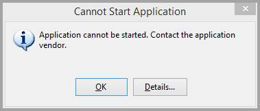

# Troubleshooting

This document provides common difficulties in running and using Kusto.Explorer, and offers solutions. This document also describes [how to reset Kusto.Explorer](#reset-kustoexplorer).

## Kusto.Explorer fails to start

### Kusto.Explorer shows error dialog during or after start-up

#### Symptom

At start-up, Kusto.Explorer shows an `InvalidOperationException` error.

#### Possible solution

This error may suggest that the operating system became corrupted or is missing some of the essential modules.
To check missing or corrupted system files, follow the steps described here:   
[https://support.microsoft.com/help/929833/use-the-system-file-checker-tool-to-repair-missing-or-corrupted-system](https://support.microsoft.com/help/929833/use-the-system-file-checker-tool-to-repair-missing-or-corrupted-system)

## Kusto.Explorer always downloads, even when there are no updates

#### Symptom

Every time you open Kusto.Explorer, you're prompted to install a new version. Kusto.Explorer downloads the entire package, without updating the already-installed version.

#### Possible solution

This symptom could be a result of corruption in your local ClickOnce store. You can clear the local ClickOnce store, by running the following command, in an elevated command prompt.

> [!IMPORTANT]
> 1. If there are any other instances of ClickOnce applications or of `dfsvc.exe`, terminate them before running this command.
> 1. All ClickOnce apps will reinstall automatically the next time you run them, as long as you have access to the original install location stored in the app shortcut. App shortcuts won't be deleted.

```kusto
rd /q /s %userprofile%\appdata\local\apps\2.0
```

Try installing Kusto.Explorer again from one of the [installation mirrors](kusto-explorer.md#installing-kustoexplorer).

### ClickOnce error: Cannot Start Application

#### Symptoms

The program fails to start and displays one of the following errors: 
* `External component has thrown an exception`
* `Value does not fall within the expected range`
* `The application binding data format is invalid.` 
* `Exception from HRESULT: 0x800736B2`
* `The referenced assembly is not installed on your system. (Exception from HRESULT: 0x800736B3)`

You can explore the error details by clicking `Details` in the following error dialog:



```kusto
Following errors were detected during this operation.
    * System.ArgumentException
        - Value does not fall within the expected range.
        - Source: System.Deployment
        - Stack trace:
            at System.Deployment.Application.NativeMethods.CorLaunchApplication(UInt32 hostType, String applicationFullName, Int32 manifestPathsCount, String[] manifestPaths, Int32 activationDataCount, String[] activationData, PROCESS_INFORMATION processInformation)
            at System.Deployment.Application.ComponentStore.ActivateApplication(DefinitionAppId appId, String activationParameter, Boolean useActivationParameter)
            at System.Deployment.Application.SubscriptionStore.ActivateApplication(DefinitionAppId appId, String activationParameter, Boolean useActivationParameter)
            at System.Deployment.Application.ApplicationActivator.Activate(DefinitionAppId appId, AssemblyManifest appManifest, String activationParameter, Boolean useActivationParameter)
            at System.Deployment.Application.ApplicationActivator.ProcessOrFollowShortcut(String shortcutFile, String& errorPageUrl, TempFile& deployFile)
            at System.Deployment.Application.ApplicationActivator.PerformDeploymentActivation(Uri activationUri, Boolean isShortcut, String textualSubId, String deploymentProviderUrlFromExtension, BrowserSettings browserSettings, String& errorPageUrl)
            at System.Deployment.Application.ApplicationActivator.ActivateDeploymentWorker(Object state)
```

#### Proposed solution steps

1. Uninstall Kusto.Explorer using `Programs and Features` (`appwiz.cpl`).

1. Try running `CleanOnlineAppCache`, and then try installing Kusto.Explorer again. 
    From an elevated command-prompt: 
    
    ```kusto
    rundll32 %windir%\system32\dfshim.dll CleanOnlineAppCache
    ```

    Install Kusto.Explorer again from one of the [installation mirrors](kusto-explorer.md#installing-kustoexplorer).

1. If the application still doesn't start, delete the local ClickOnce store. All ClickOnce apps will reinstall automatically the next time you run them, as long as you have access to the original install location stored in the app shortcut. App shortcuts won't be deleted.

    From an elevated command-prompt:

    ```kusto
    rd /q /s %userprofile%\appdata\local\apps\2.0
    ```

    Install Kusto.Explorer again from one of the [installation mirrors](kusto-explorer.md#installing-kustoexplorer)

1. If the application still doesn't start:
    1. Remove temporary deployment files.
    1. Rename the Kusto.Explorer local AppData folder.

        From an elevated command-prompt:

        ```kusto
        rd /s/q %userprofile%\AppData\Local\Temp\Deployment
        ren %LOCALAPPDATA%\Kusto.Explorer Kusto.Explorer.bak
        ```

    1. Install Kusto.Explorer again from one of the [installation mirrors](kusto-explorer.md#installing-kustoexplorer)

    1. To restore your connections from Kusto.Explorer.bak, from an elevated command-prompt:

        ```kusto
        copy %LOCALAPPDATA%\Kusto.Explorer.bak\User*.xml %LOCALAPPDATA%\Kusto.Explorer
        ```

#### Enabling ClickOnce verbose logging

1. If the application still doesn't start:
    1. [Enable verbose ClickOnce logging](/visualstudio/deployment/how-to-specify-verbose-log-files-for-clickonce-deployments) by creating a LogVerbosityLevel string value of 1 under:

        ```kusto
        HKEY_CURRENT_USER\Software\Classes\Software\Microsoft\Windows\CurrentVersion\Deployment
        ```
    
    1. Repro it again.
    1. Send the verbose output to KEBugReport@microsoft.com. 

### ClickOnce error: Your administrator has blocked this application because it potentially poses a security risk to your computer

#### Symptom 
The application fails to install with either of the following errors:
* `Your administrator has blocked this application because it potentially poses a security risk to your computer`.
* `Your security settings do not allow this application to be installed on your computer.`

#### Solution

This symptom could be because another application is overriding the default ClickOnce trust prompt behavior. 
1. View your default configuration settings.
1. Compare your configuration settings to the actual ones on your machine.
1. Reset your configuration settings as necessary, as explained [in this how-to article](/visualstudio/deployment/how-to-configure-the-clickonce-trust-prompt-behavior).

### Cleanup application data

Sometimes, when previous troubleshooting steps didn't help with getting Kusto.Explorer to start, cleaning data stored locally may help.

Data stored by Kusto.Explorer application can be found here: `C:\Users\[your username]\AppData\Local\Kusto.Explorer`.

> [!NOTE]
> Cleaning the data will lead to a loss of opened tabs (Recovery folder), saved connections (Connections folder), and application settings (UserSettings folder).

## Reset Kusto.Explorer

If you need to, you can completely reset Kusto.Explorer. The following procedure describes how to progressively reset Kusto.Explorer, until it's removed from your computer and must be installed from scratch.

1. In Windows, open **Change or remove a program** (also known as **Programs and Features**).
1. Select every item that starts with `Kusto.Explorer`.
1. Select **Uninstall**.

   If this procedure fails to uninstall the application (a known issue with ClickOnce applications), see [this article for instructions](https://stackoverflow.com/questions/10896223/how-do-i-completely-uninstall-a-clickonce-application-from-my-computer).

1. Delete the folder `%LOCALAPPDATA%\Kusto.Explorer`, which removes all connections, history, and so on.

1. Delete the folder `%APPDATA%\Kusto`, which removes the Kusto.Explorer token cache. You'll need to reauthenticate to all clusters.

It's also possible to revert to a specific version of Kusto.Explorer:

1. Run `appwiz.cpl`.
1. Select **Kusto.Explorer** and select **Uninstall/Change**.
1. Select **Restore the application to its previous state**.

## Related content

* Learn about the [Kusto.Explorer user interface](kusto-explorer.md#overview-of-the-user-interface)
* Learn about [running Kusto.Explorer from the command line](kusto-explorer-using.md#kustoexplorer-command-line-arguments)
* Learn about [Kusto Query Language (KQL)](../query/index.md)